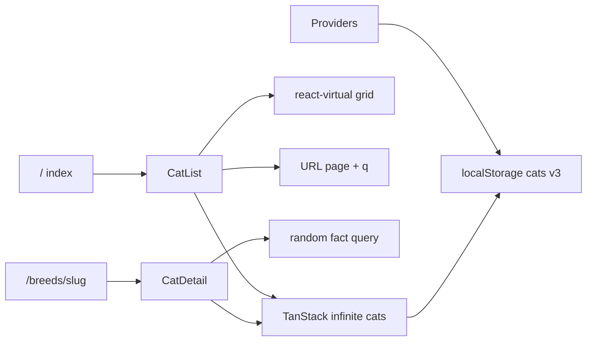

# Cat Directory

Browse cat breeds from [catfact.ninja](https://catfact.ninja): virtualized infinite list, client search, deep-linkable scroll, breed detail with a random fact.

Live: [https://cat-directory.juanalvarez.dev/](https://cat-directory.juanalvarez.dev/)

## Setup

### Stack

| Layer | Choice |
|-------|--------|
| Framework | Next.js 16.3 (App Router), React 19 |
| Data | TanStack Query (infinite + persist), Axios, Zod |
| List UX | `@tanstack/react-virtual` |
| UI | Tailwind 4, Base UI / shadcn |
| Tests | Vitest + Testing Library + jsdom |

### Prerequisites

- Node.js current LTS (compatible with Next 16)
- Network access to `https://catfact.ninja`
- No env vars — API base URL is hardcoded in [`lib/api/client.ts`](lib/api/client.ts)

### Commands

```bash
npm install
npm run dev          # http://localhost:3000
npm run build && npm start
npm run lint
npm test             # Vitest watch
npm run test:run     # CI / one-shot
```

### External API

| Endpoint | Use |
|----------|-----|
| `GET /breeds?page=&limit=` | Paginated breeds (page size 10) |
| `GET /fact` | Random cat fact on detail |

## Feature map



| Area | Behavior | Where |
|------|----------|-------|
| Directory | Responsive virtualized grid (1/2/4 cols), infinite scroll | [`components/cat-list.tsx`](components/cat-list.tsx) |
| Search | Client filter on breed + country; 300ms debounce; `?q=` (max 100 chars) | [`lib/hooks/use-cat-search.ts`](lib/hooks/use-cat-search.ts) |
| Deep links | `?page=` restored on load; scroll writes page via `history.replaceState` | [`lib/hooks/use-scroll-restore.ts`](lib/hooks/use-scroll-restore.ts), [`lib/hooks/use-sync-page-from-scroll.ts`](lib/hooks/use-sync-page-from-scroll.ts) |
| Refresh | Header button; mobile pull-to-refresh | [`lib/hooks/use-cats-refresh.ts`](lib/hooks/use-cats-refresh.ts), [`lib/hooks/use-pull-to-refresh.ts`](lib/hooks/use-pull-to-refresh.ts) |
| Detail | Slug route; resolve breed by walking the shared infinite cache; back keeps `page`/`q` | [`app/breeds/[slug]/page.tsx`](app/breeds/[slug]/page.tsx), [`components/cat-detail.tsx`](components/cat-detail.tsx) |
| Fact | Fresh random fact per detail visit | [`components/random-fact.tsx`](components/random-fact.tsx) |
| Cache | SSR prefetch + hydrate; persist cats only (3 pages, 24h, key `cat-directory-cats-v3`) | [`app/page.tsx`](app/page.tsx), [`lib/query/persist.ts`](lib/query/persist.ts) |
| Resilience | Soft-fail SSR prefetch, Retry UI, empty / end-of-list states | [`components/query-error.tsx`](components/query-error.tsx), [`components/empty-state.tsx`](components/empty-state.tsx) |
| A11y | Skip link, focus on main/heading, live regions, reduced-motion PTR | [`app/layout.tsx`](app/layout.tsx), list/detail components |

**Tests:** Vitest covers home list/filter/refresh, breed detail + fact, slug/URL/scroll math, and persist hydrate/trim. No E2E; no dedicated tests for pull-to-refresh or scroll restore.

## Trade-offs

| Decision | Chose | Cost |
|----------|-------|------|
| Breed source of truth | One shared `["cats"]` infinite query for list **and** detail | Detail may `fetchNextPage` until the slug appears — main driver of mobile detail LCP |
| Rendering | Client shells (`CatList` / `CatDetail`) + SSR hydrate | Interactive virtual/search/URL sync; main content not streamed as HTML |
| Routing cache | `force-dynamic`; index prefetches pages `1..?page` | Correct deep links; no static edge HTML; cold high-`page` hits the API harder |
| Detail SSR | Prefetch page 1 only | Fast server path; client still resolves the breed |
| Search | Filter loaded pages client-side (no API `q`) | Rare matches keep paging (“Searching…”); extra traffic while filtering |
| Persist | Cats query only; max 3 pages; 24h TTL; sync `localStorage` | Snappy revisit; deep scroll not fully offline; sync JSON write on the main thread |
| Virtual rows | Fixed row height (112px) | Simple page↔scroll math; breaks if card layout grows |
| Refresh | Custom pull-to-refresh + header button | Non-passive `touchmove` on mobile; desktop is button-only |
| API access | Browser → catfact.ninja (no BFF) | Simple; CORS, latency, and rate limits are yours |
| Tests | Vitest + jsdom, mocked layout APIs | Fast unit coverage; virtual scroll behavior is not fully realistic |

Measured impact of the shared-cache / client-detail path: [docs/lighthouse-findings.md](docs/lighthouse-findings.md).

## Talking points

- **Mobile detail Performance 81** — Lab LCP ~5.1s / TTI ~5.1s under Slow 4G + CPU throttle; unthrottled LCP on the same run ~0.9s. Index is 99 desktop / 100 mobile. Root cause matches architecture: client `CatDetail` resolving breed from the infinite query (possibly paging). Details and re-run commands: [docs/lighthouse-findings.md](docs/lighthouse-findings.md).
  - The API doesn't expose a "/breeds/[id]" endpoint. This leaves the strategy of searching for a breed very straightforward: look through the pages until you match one. This, for some breeds, can become expensive quickly. Lighthouse uses a throttled connection to mimic a slower device than usual. Because of that, the page looks "slow" on numbers. To make it faster, you'd have to use SSR directly on the page.

- **Index near-perfect scores** — Documented baseline; no urgent work called out in lighthouse findings.
  - There was close to no performance work done on the repo. I only cached the first page with TanStack Persistence, but I didn't allow myself to chase micro-optimizations in this version.

- **No BFF / no env** — Axios base URL hardcoded to catfact.ninja.
  - There was nothing to "hide" in this repo since the API is public. No token, keys or secrets to consume. Removing the step of checking for env variables makes the project a bit more straightforward.

- **Client-only search** — `filterCats` over pages already in cache; API has no search param in use.
  - This is another constraint of the API (and the take-home's explicit ask). To make this requirement complete, the query keeps fetching until matches appear or the list ends. In a real-world scenario, server-side search is more desirable for applications to avoid this kind of logic.

- **Persist caps** — 3 pages, 24h, storage key `cat-directory-cats-v3` ([`lib/query/persist.ts`](lib/query/persist.ts)).
  - I don't find any particular reason to cache more than 3 pages. The API is fast enough and the assignment asked for page 1. For this app it's enough for the revisit cycle without blowing localStorage out of proportion.

- **No Redux / no `useReducer`** — Server/async state lives in TanStack Query (cache, retries, infinite pages, persist). Local UI concerns are small hooks + `useState` (`q`, pull distance, restore flags). There is no global client store and no reducer machine for list/detail.
  - For two pages and using TanStack Query, useReducer/Redux would add more noise than real functionality. You can cache the queries, use them as state machines, and Query provides the API for the various async states natively. Saving the data from the query into a useReducer, for example, adds a second source of truth, which is not necessary.

## Why and how I use Cursor

This project was built using Cursor, the AI coding agent. In this day and age, AI is ingrained into software development. The way I incorporate Cursor or any coding agent (like Claude Code, for example) is very particular. I followed this framework:

- Drafting: I don't like to use AI tools to create and draft tasks. Instead, I digest the requirements myself first, draft a plan, and separate everything into steps. These steps or issues are displayed in the various commits and PRs in the repo.
- Planning: I use the AI agents to plan the issues, one by one. I read and approve the plan before any code is created. I make sure to understand what's going on in the plan.
- Execution: I let the AI generate the code. This is the part where AI shines best — it takes patterns I already approved before and creates the code based on that. Since the plan has been greenlit, there is no problem in using auto-mode for this.
- Review: I check the lines of code produced. I then ask for meaningful splits where needed. After looking at the code integrity and testing in the browser (if any UI changes were made), I create the PRs using skills.

One of my focuses is "Using AI to produce something a human eye will see". AI code that is not understood can't be audited. And code that can't be audited can't be shipped with confidence. This framework allows developers to work alone or in a team in a more conscious way and create better products. 